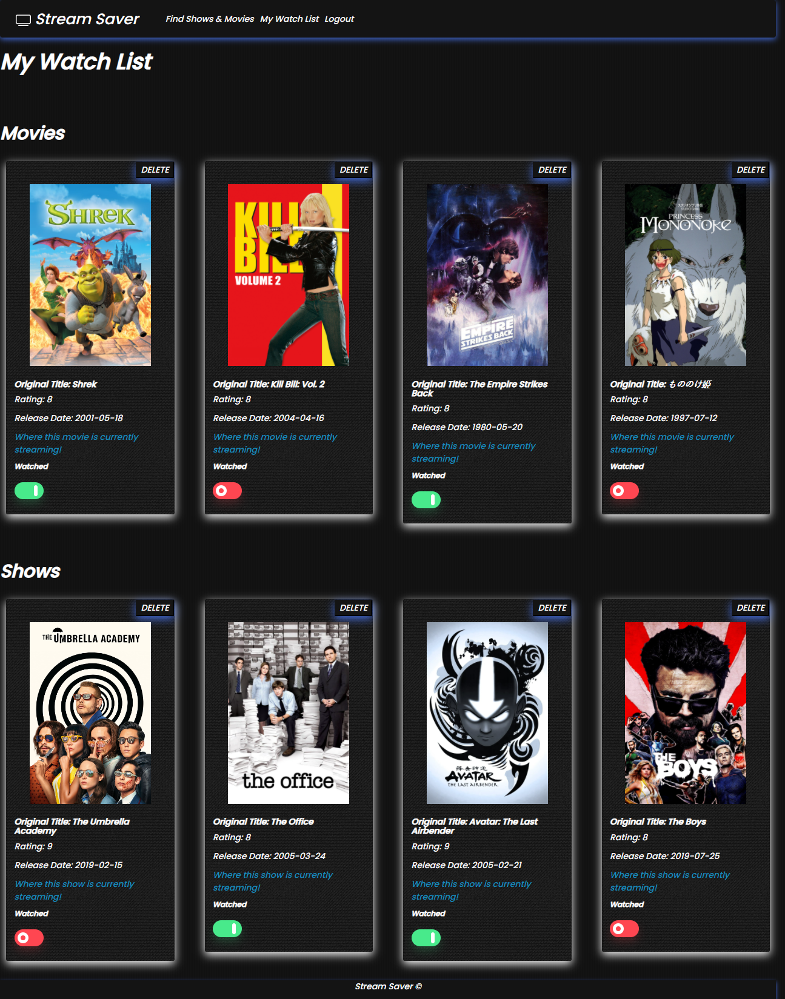

# 🖥️ Stream Saver
[CLICK HERE FOR LIVE HEROKU APPLICATION](https://stream-saver.herokuapp.com/)

## Table of Contents
* [Screenshots](#screenshots)

* [User Story](#user-story)

* [Application Description](#application-description)

* [Installation](#installation)

* [Usage](#usage)

* [Demo](#demo)

* [Built With](#built-with)

* [Contributors](#contributors)

* [License](#license)

* [Questions](#questions)

## Screenshots 




## User Story
```
As a user, I want to know where I can stream the latest and greatest shows and movies.
I want to save time by knowing how many seasons my show has,
Along with where my shows and movies are streaming and watch recommendations all in one app.
I also want to save my favorite shows and movies to view later.

```

## Application Description

An application that lets the user search for any show or movie they'd like to stream. This application shows where this show or movie is currently streaming and, if a show, how many seasons are available for easy viewing access. The user can navigate to a link that shares where the selected show or movie is currently streaming. The user can save the shows they want to watch that will be viewable once they sign into their account.

## Installation 
```
npm i 
```

## Usage 
```
Run "node server.js" to start then navigate to a browser window to localhost:8080

OR
                                     
Use the live application via the Heroku link provided above

```
## Demo

## Built With
* Heroku
* MySQL
* Passport 
* Sequelize 
* Express
* Node
* Handlebars 
* ORM
* MVC 
* JSON
* JQuery 
* Bootstrap

## Contributors 

Ian Fusi 
* Github: [ianf777](https://github.com/ianf777) 
* Email: <ianwfuzzy@gmail.com> 

 Max Goldstein
* Github: [maxgoldstein93](https://github.com/maxgoldstein93) 
* Email: <magoldstein93@gmail.com>


 Kristy Keller
* Github: [KristyKeller](https://github.com/KristyKeller)
* Email: <keller.kristy@outlook.com>

James Lamb
* Github: [Lambaa94](https://github.com/Lambaa94) 
* Email: <jameslamb13@gmail.com>

## License

[](https://opensource.org/licenses/MIT)

Copyright 2020 ©Ian Fusi, Max Goldstein, Kristy Keller, James Lamb

<sup>Permission is hereby granted, free of charge, to any person obtaining a copy of this software and associated documentation files (the "Software"), to deal in the Software without restriction, including without limitation the rights to use, copy, modify, merge, publish, distribute, sublicense, and/or sell copies of the Software, and to permit persons to whom the Software is furnished to do so, subject to the following conditions:
  
<sup>The above copyright notice and this permission notice shall be included in all copies or substantial portions of the Software.
  
<sup>THE SOFTWARE IS PROVIDED "AS IS", WITHOUT WARRANTY OF ANY KIND, EXPRESS OR IMPLIED, INCLUDING BUT NOT LIMITED TO THE WARRANTIES OF MERCHANTABILITY, FITNESS FOR A PARTICULAR PURPOSE AND NONINFRINGEMENT. IN NO EVENT SHALL THE AUTHORS OR COPYRIGHT HOLDERS BE LIABLE FOR ANY CLAIM, DAMAGES OR OTHER LIABILITY, WHETHER IN AN ACTION OF CONTRACT, TORT OR OTHERWISE, ARISING FROM, OUT OF OR IN CONNECTION WITH THE SOFTWARE OR THE USE OR OTHER DEALINGS IN THE SOFTWARE.

## Questions

If you have any questions regarding this repo, please contact any of the above mentioned contributors via Github or email.
